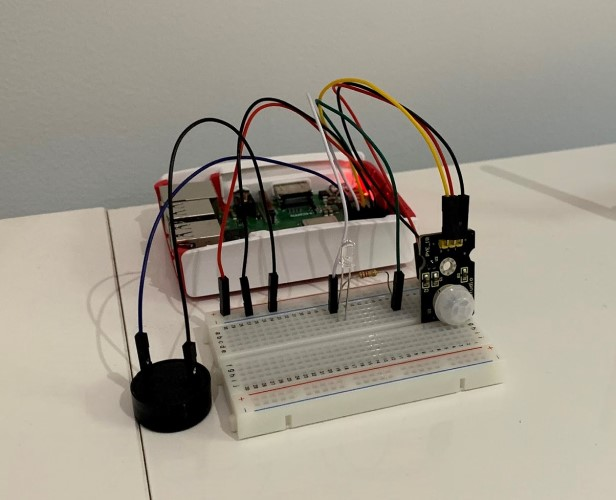

# IoT Motion Sensor Detector with Buzzer, LED and Power BI feed
Simple Raspberry PI 3 project showcasing a motion sensor, buzzer, LED + integration with Azure IoT Hub and Power BI

# Getting started
## Set up your environment (.env) file

Create a .env file in your root directory and populate it with the below. If Power BI environments are blank, nothing will be sent to PubNub

      pbi_subscribe_key=<PubNub subscribe key>
      pbi_publish_key=<PubNub publish key>
      iot_connection_string=<device connection string from IoT Hub in Azure>

## Set up your Virtual Environment

## Create IoT Hub and BLOB Storage

## Create PubNub
