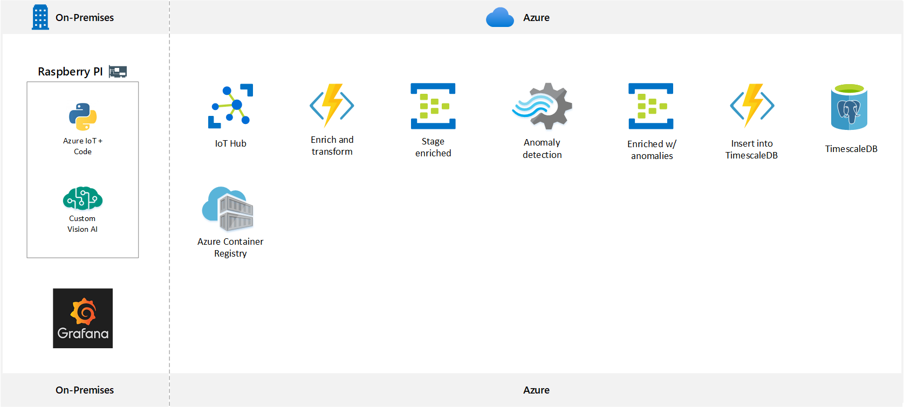

# IoT Garden

IoT enabled solution to keep your plant alive!
  - Automated watering system
  - Soil moisture, temperature and humidity sensors
  - Anomaly analysis of telemtry
  - Computer vision to understand health of plant
  - Grafana to track plant health in real-time

## Project Repositories

| Repository        | Description                                                                                        | Link                                                           |   
|-------------------|----------------------------------------------------------------------------------------------------|----------------------------------------------------------------|
| iot-garden-azfunc | Python Azure Function used to insert data into TimescaleDB from IoT Hub. Event triggered.          |  [Link](https://github.com/richardleeaus/iot-garden-azfunc)    |   
| iot-garden        | Base repository for Raspberry PI solution. Uses Azure IoT Device SDK and GPIO for reading sensors. |                                                                |   
 

## Architecture




## Raspberry Pi Pictures

> Coming soon

## Invoke Remote Functions on Raspberry PI via IoT Hub

The below functions are examples that can be leveraged by applications that need to interact with your IoT device.

### Remote function `pump_water`

Function used to trigger the water pump remotely

### Remote function `get_plant_metrics`

Function used to retrieve the sensor metrics from the Raspberry PI

## Raspberry PI + Sensors List

> Coming soon

# Getting started with local environment

## Development tools used

- Docker for Windows
- VSCode
  - Extensions
    - Docker
    - Remote WSL
    - Remote SSH
    - Python
    - Azure Functions
    - Azure Account
- OS
  - Raspian (Raspberry PI)
  - WSL2 (For cross-platform development on Windows 10)
- Azure Cloud Shell (For AZ CLI commands)

## Set up your environment (.env) file

```xml
iot_connection_string=<iot-connection-string>
log_analytics_instrumentation_key=<app-insights-instrumentation-key>
analogue_device=mcp3008
pin_number_pump=16
pin_number_dht=12
log_level=INFO
pin_clk=18
pin_miso=23
pin_mosi=24
pin_cs=25
analogue_channel=4
```

## Install Python 3.7

Using raspbian on your Rapberry PI, you may have a old version of Python which isn't compatiable with a few packages.

```bash
sudo apt-get update
sudo apt-get install -y build-essential tk-dev libncurses5-dev libncursesw5-dev libreadline6-dev libdb5.3-dev libgdbm-dev libsqlite3-dev libssl-dev libbz2-dev libexpat1-dev liblzma-dev zlib1g-dev libffi-dev

wget https://www.python.org/ftp/python/3.7.7/Python-3.7.7.tgz
sudo tar zxf Python-3.7.7.tgz
cd Python-3.7.7
sudo ./configure
sudo make -j 4
sudo make altinstall
python3.7 -V
```

## Install psycopg2

We don't need to install psycopg2 on the raspberry pi, but just in case.
```bash
git clone https://github.com/psycopg/psycopg2
cd psycopg2
`which python3.7` setup.py build
`which python3.7` setup.py install
```

## Set up your Virtual Environment

```bash
python3.7 -m venv ~/GIT/iot-garden/env
source env/bin/activate
pip install -r requirements.txt --default-timeout=100
```

# Setup Azure services

## Setup TimescaleDB

TimescaleDB is a time series database used to store the telemetry created from the device.

### Azure CLI

```sh
servername="gardendb-analytics"
resourcegroup="iot-plant-home"
skuname="b_gen5_1"

az postgres up --server-name $servername --resource-group $resourcegroup --sku-name $skuname
az postgres server configuration set --resource-group $resourcegroup --name shared_preload_libraries --value timescaledb --server-name $servername
az postgres server restart --resource-group $resourcegroup --name $servername
```

> Before connecting with Azure Data Studio, you'll need to add your IP to the firewall

### Setup database
```sql
create database plant_monitor;

--Change context to new db

CREATE EXTENSION IF NOT EXISTS timescaledb CASCADE;

create table sensor_data (
    timestamp TIMESTAMPTZ NOT NULL,
    device TEXT NOT NULL,
    category TEXT NOT NULL,
    value DOUBLE PRECISION NULL,
    state TEXT NULL
);

SELECT create_hypertable('sensor_data', 'timestamp');
```

## Setup IoT Hub

We use IoT Hub to remotely control the watering system and receive device messages

```sh
iothubname=""
rg="iot-plant-home"
rpi-device-id="raspberrypi3"

# Add extension and create
az extension add --name azure-cli-iot-ext

az iot hub create --name $iothubname \
   --resource-group $rg --sku S1

az iot hub device-identity create --hub-name $iothubname --device-id $rpi-device-id

# Get connection string
az iot hub device-identity show-connection-string --device-id $rpi-device-id --hub-name $iothubname

# Monitor events
az iot hub monitor-events --hub-name $iothubname --output table
```

## Setup Event Hub for Anomaly Detection

```sh
ns="anomaly-output-eh"
rg="iot-plant-home"
eventhub="anomalies"

# Create an Event Hubs namespace. Specify a name for the Event Hubs namespace.
az eventhubs namespace create --name $ns --resource-group $rg

# Create an event hub. Specify a name for the event hub. 
az eventhubs eventhub create --name $eventhub --resource-group $rg --namespace-name $ns
```

# Setup local visualisation

## Grafana

Grafana is an open-source time series visualisation tool


# Build Docker container

> Coming soon

# Run from Docker Compose

```bash
$ docker-compose up
```

> Coming soon

